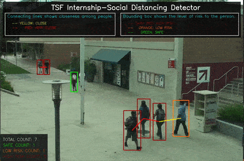

# Social-Distancing-Detector

A social distancing Detector tool to regulate social distancing protocol using video surveillance of CCTV cameras and drones.

Social Distancing Detector automatically detects the extent to which social distancing protocols are followed in the area.

#### output:

#### Please Note: angle factor is needed to be set between 0 to 1 for v2.0 according to the angle of camera (move towards one as angle becomes verticle)
## Installation:
* Fork the repository and download the code.
* Download the following files and place it in the same directory
   - https://github.com/pjreddie/darknet/blob/master/cfg/yolov3.cfg
   - https://pjreddie.com/media/files/yolov3.weights
* For slower CPUs, use yolov3-tiny (link in the code comments)
* Install all the dependenices
* Run social_distancing_detector.py
### Credits:

@article{yolov3,
  title={YOLOv3: An Incremental Improvement},
  author={Redmon, Joseph and Farhadi, Ali},
  journal = {arXiv},
  year={2018}
}
